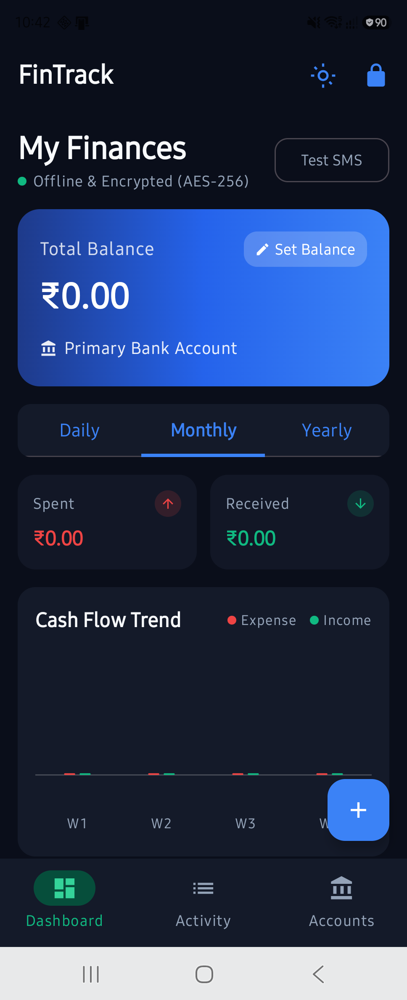

# FinTrack 🛡️💳
### Privacy-First, Air-Gapped Personal Finance & Expense Intelligence System for Android

[](https://kotlinlang.org)
[](https://developer.android.com/studio/releases/gradle-plugin)
[](https://developer.android.com/jetpack/compose)
[](https://developer.android.com/reference/androidx/security/crypto/EncryptedFile)
[-0A192F.svg)](AndroidManifest.xml)
[](#)

---

## 📌 Executive Summary

**FinTrack** is an offline-native personal financial operating system built from the ground up for modern Android. It automates financial ledgering by capturing incoming transaction alerts from Indian banks (HDFC, SBI, ICICI, Axis, Kotak, PNB, Canara, BoB) and UPI rails (PhonePe, Google Pay, Paytm, CRED).

Unlike conventional expense management applications that upload your SMS and financial data to remote cloud servers, **FinTrack operates under a strict, hardware-enforced air-gapped security model**:
- **Zero Internet Permission:** The application manifest intentionally omits `android.permission.INTERNET`. The Android OS physically prevents any socket, HTTP, or telemetry connection.
- **Hardware-Backed AES-256-GCM Encryption:** All stored financial data, notes, and account records are encrypted at rest using keys sealed within the device's hardware Secure Element / StrongBox (`AndroidKeyStore`).
- **Zero Idle Battery Consumption:** Built entirely on an event-driven `BroadcastReceiver` architecture that executes in under 15ms per SMS, sleeping 100% of the time otherwise.
- **Dynamic Ledger Reconciliation:** Seamlessly synchronizes manual balance baselines, cash entries, and bank SMS closing balances with automatic discrepancy adjustments.

---

## 📱 Application Preview

<p align="center">
  
  <br>
  <em>Live Execution of FinTrack v1.0 running on Samsung Galaxy (Android 14)</em>
</p>

---

## 🏛️ Core Architecture & Pipeline

```
                               ┌────────────────────────────────┐
                               │     Incoming Cellular SMS      │
                               │  (HDFC, SBI, ICICI, Axis, UPI) │
                               └────────────────┬───────────────┘
                                                │
                                                ▼
                               ┌────────────────────────────────┐
                               │      SmsBroadcastReceiver      │
                               │  (<15ms burst, zero background)│
                               └────────────────┬───────────────┘
                                                │
                       ┌────────────────────────┴────────────────────────┐
                       ▼                                                 ▼
        ┌──────────────────────────────┐                 ┌──────────────────────────────┐
        │  Proactive Non-Bank Filter   │                 │     IndianBankSmsParser      │
        │   (OTP / Promos dropped <1ms)│                 │  Multi-token regex engine    │
        └──────────────────────────────┘                 └──────────────┬───────────────┘
                                                                        │
                                                                        ▼
                                                         ┌──────────────────────────────┐
                                                         │      ExpenseCategorizer      │
                                                         │ (On-device heuristic AI)     │
                                                         └──────────────┬───────────────┘
                                                                        │
                                                                        ▼
                                                         ┌──────────────────────────────┐
                                                         │       SecurityManager        │
                                                         │  AndroidKeyStore AES-256-GCM │
                                                         └──────────────┬───────────────┘
                                                                        │
                                                                        ▼
                                                         ┌──────────────────────────────┐
                                                         │      AppDatabaseHelper       │
                                                         │  (Encrypted SQLite Ledger)   │
                                                         └──────────────┬───────────────┘
                                                                        │
                                                                        ▼
                                                         ┌──────────────────────────────┐
                                                         │    Jetpack Compose UI        │
                                                         │  (StateFlow Reactive Canvas) │
                                                         └──────────────────────────────┘
```

---

## 🛡️ Security & Privacy Guarantees

| Security Feature | Implementation | Threat Defeated |
|---|---|---|
| **Air-Gap Architecture** | Complete absence of `android.permission.INTERNET` in `AndroidManifest.xml`. | Remote data exfiltration, spyware, third-party analytics leaks. |
| **Hardware Key Sealing** | 256-bit symmetric AES key generated in `AndroidKeyStore` Secure Element (`KeyGenParameterSpec`). | Extraction of raw cryptographic keys even via root exploit. |
| **Authenticated Encryption** | `AES/GCM/NoPadding` with 12-byte random IV prepended per record. | Database tampering, bit-flipping attacks, unauthorized injection. |
| **Master PIN & Lockout** | SHA-256 hash with 16-byte unique device salt; progressive lockout timer after 5 failed attempts. | Physical theft, shoulder-surfing, automated brute-force attacks. |
| **Backup Prevention** | Custom `backup_rules.xml` and `data_extraction_rules.xml` excluding databases and preferences. | Cloud backup leaks via Google Drive or ADB backup extractions. |

---

## ⚡ Battery Efficiency Design

- **Event-Driven Execution:** FinTrack has **NO** long-running background services, **NO** periodic polling workers (`WorkManager`), and **NO** wake-lock alarms.
- **Fast-Path Filter:** Incoming SMS messages are checked against known banking sender headers (e.g., `HDFCBK`, `SBIINB`, `ICICIB`, `KOTAKB`, `AXISBK`) and transaction keywords (`debited`, `credited`, `spent`, `transferred`). Non-financial alerts (OTPs, personal chats, marketing spam) are dropped in under **1 millisecond**.
- **CPU Cycle Preservation:** The entire lifecycle from SMS arrival to encrypted database insertion completes in under **15 milliseconds**, allowing the mobile SoC to immediately return to deep sleep state (`suspend`).

---

## 📊 Key Features

- **Automated Bank SMS Ingestion:** Supports major Indian public and private banks and UPI rail payment notifications.
- **Smart Heuristic Categorization:** Automatically maps transactions into 12 primary financial categories (Groceries, Food & Dining, Shopping, Utilities, Fuel & Travel, Entertainment, Healthcare, Investment, Transfer, Salary, Cash, Others).
- **Interactive Compose Visualizations:** Custom Canvas-drawn Donut Charts and Daily Spending Bar Graphs with interactive category filtering.
- **Multi-Account Tracking:** Consolidated view of Net Worth, Savings Accounts, Credit Cards, and Cash Wallets.
- **Dynamic Ledger Reconciliation:** Automatic compensating entries whenever an SMS provides an official bank closing balance.
- **Dark & Light Fintech Theme:** High-contrast Material 3 UI with Emerald and Indigo accent palettes.
- **Custom Vector Graphics:** 100% self-contained vector icons in `AppIcons.kt` eliminating third-party icon library bloat.

---

## 📁 Repository Structure

```
FinTrack/
├── app/
│   ├── src/
│   │   ├── main/
│   │   │   ├── java/com/example/fintrack/
│   │   │   │   ├── MainActivity.kt               # Single Activity lifecycle & permissions
│   │   │   │   ├── Navigation.kt                 # Route contracts
│   │   │   │   ├── NavigationKeys.kt             # Navigation arguments
│   │   │   │   ├── data/
│   │   │   │   │   ├── DataRepository.kt         # Repository interface
│   │   │   │   │   ├── local/
│   │   │   │   │   │   ├── AppDatabaseHelper.kt  # Encrypted SQLite ledger & StateFlows
│   │   │   │   │   │   ├── PinManager.kt         # Master PIN & lockout security
│   │   │   │   │   │   ├── SecurityManager.kt    # AndroidKeyStore AES-256-GCM engine
│   │   │   │   │   │   └── ThemePreferenceManager.kt # Theme persistence
│   │   │   │   │   ├── model/
│   │   │   │   │   │   ├── Account.kt            # Financial account entity
│   │   │   │   │   │   ├── Category.kt           # Category taxonomy
│   │   │   │   │   │   ├── DashboardSummary.kt   # Aggregated period analytics
│   │   │   │   │   │   └── Transaction.kt        # Double-entry ledger record
│   │   │   │   │   └── repository/
│   │   │   │   │       └── TransactionRepository.kt # Business repository
│   │   │   │   ├── parser/
│   │   │   │   │   ├── ExpenseCategorizer.kt     # Heuristic classification AI
│   │   │   │   │   ├── IndianBankSmsParser.kt    # Multi-pattern regex parser
│   │   │   │   │   └── ParsedTransaction.kt     # Intermediate DTO
│   │   │   │   ├── receiver/
│   │   │   │   │   └── SmsBroadcastReceiver.kt   # Sub-15ms event-driven receiver
│   │   │   │   ├── theme/
│   │   │   │   │   ├── Color.kt                  # Fintech palettes
│   │   │   │   │   ├── Theme.kt                  # Material 3 Compose theme
│   │   │   │   │   └── Type.kt                   # Typography scale
│   │   │   │   └── ui/
│   │   │   │       ├── MainAppShell.kt           # Scaffold, bottom bar, FAB
│   │   │   │       ├── accounts/                 # Multi-account screen
│   │   │   │       ├── auth/                     # PIN & biometric lock screen
│   │   │   │       ├── components/               # AppIcons, Charts, CommonDialogs
│   │   │   │       ├── dashboard/                # Period selector & charts
│   │   │   │       └── transactions/             # Filterable transaction ledger
│   │   │   ├── res/                              # Layouts, vector drawables, mipmaps
│   │   │   └── AndroidManifest.xml               # Hardened air-gapped manifest
│   │   └── test/                                 # 100% passing unit test suites
│   └── build.gradle.kts                          # App build configuration & signing
├── gradle/                                       # Gradle wrapper & version catalogs
├── FinTrack_Architecture_and_Code_Documentation.pdf # 102-page complete documentation
├── FinTrack-v1.0.apk                             # Signed release production APK
└── README.md                                     # Project overview
```

---

## 🛠️ Build & Installation Guide

### Prerequisites
- Android Studio Ladybug / Meerkat or Command-Line Android SDK
- JDK 17 or JDK 21
- Android Device running Android 8.0+ (API Level 26+)

### 1. Compile from Source
```bash
# Clone the repository
git clone https://github.com/yatin536/FinTrack.git
cd FinTrack

# Run unit tests
./gradlew test

# Assemble release APK
./gradlew assembleRelease
```

### 2. Direct Device Installation via ADB
```bash
# Sideload the release APK directly to connected Android phone
adb install -r -g FinTrack-v1.0.apk

# Launch the application
adb shell am start -n com.example.fintrack/.MainActivity
```

---

## 📖 Comprehensive Project Documentation

A full **102-page Architecture & Code Documentation PDF** is included in this repository:
👉 [**FinTrack_Architecture_and_Code_Documentation.pdf**](FinTrack_Architecture_and_Code_Documentation.pdf)

It covers:
- System Foundations & In-depth "Why & How" Architectural Decisions
- Cryptographic Proofs & Play Protect Compliance Analysis
- Table of Contents indexing every file with direct anchors
- Complete, unabridged source code for all 55 repository files
- Physical device verification screenshots and benchmark timings

---

## 👤 Author
**Yatin Kumar Singh**  
- Email: yatin536@gmail.com  
- GitHub: [@yatin536](https://github.com/yatin536)  
